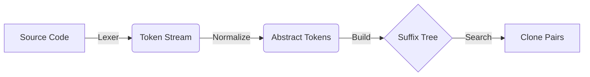
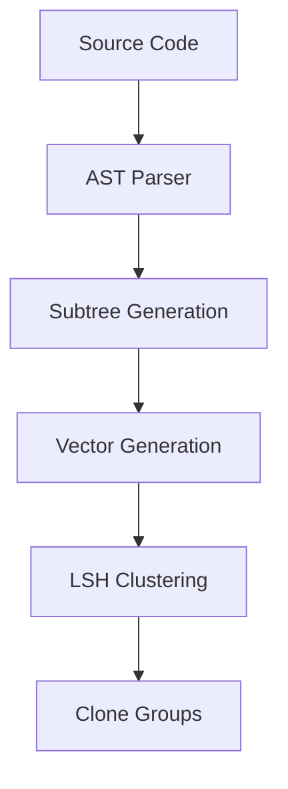
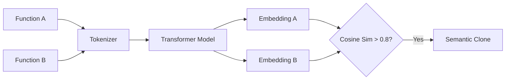
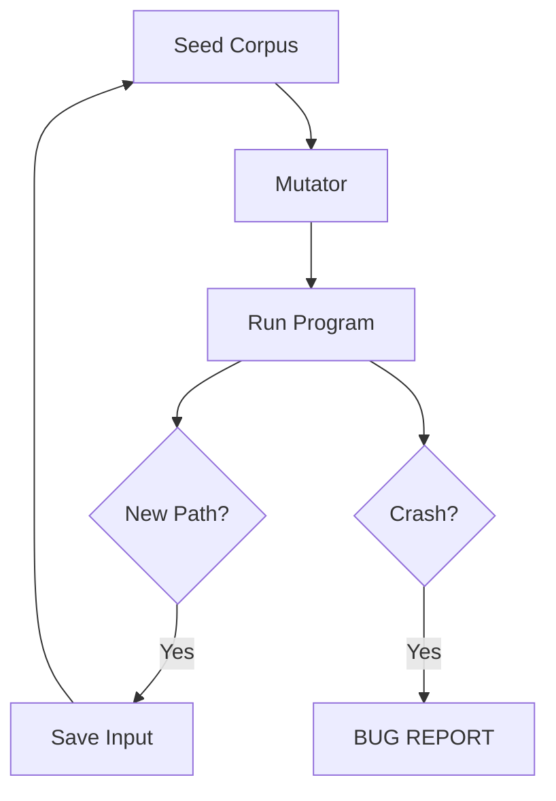
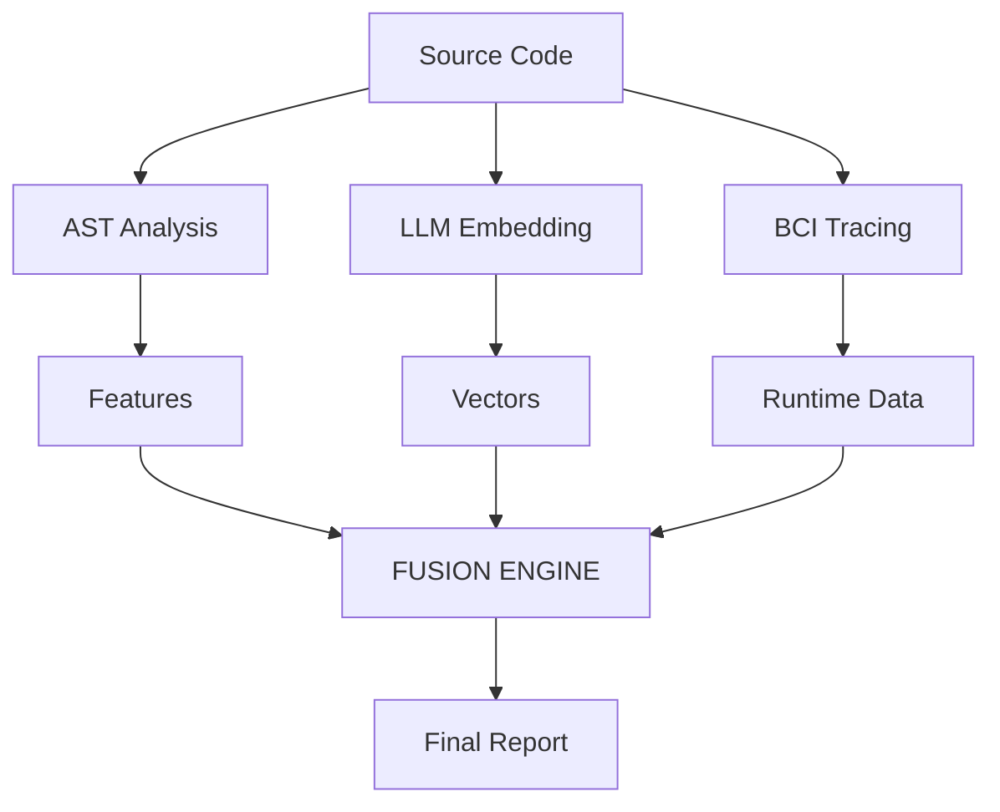

# Literature Review

This section analyzes five distinct approaches to bug detection and code cloning, representing the evolution of the field from simple text matching to modern AI-driven hybrid systems.

---

## Paper 1: Token-Based Clone Detection (e.g., CCFinder)
**Category**: Lexical Analysis
**Core Idea**: Code is just a sequence of tokens. By normalizing identifiers, we can find similar sequences.

### Detailed Workflow
1.  **Input**: Source Code (C++, Java, COBOL).
2.  **Preprocessing**:
    - **Lexical Analysis**: Convert source code into a stream of tokens (e.g., `if (a > b)` -> `IF`, `ID`, `GT`, `ID`).
    - **Normalization**: Replace all variable names with a generic token `P` (Parameter) or `V` (Variable).
3.  **Algorithm**: Suffix Tree Matching.
    - Construct a Suffix Tree from the token stream.
    - Identify repeated substrings in the tree.
4.  **Output**: Pairs of file coordinates (StartLine, EndLine) that match.

### Workflow Diagram

**Limitations**: Fails to detect clones where statements are reordered (Type 3) or implemented differently (Type 4).

---

## Paper 2: AST-Based Detection (e.g., Deckard)
**Category**: Structural Analysis
**Core Idea**: Code has a hierarchical structure. Similar subtrees in the Abstract Syntax Tree (AST) imply similar logic.

### Detailed Workflow
1.  **Input**: Source Code.
2.  **Preprocessing**: Parse code into an AST.
3.  **Algorithm**: Characteristic Vectors.
    - For every subtree, count features (e.g., # of If-statements, # of Loops, # of Calls).
    - Create a vector: `v = [2, 1, 5, ...]`.
    - Use Locality Sensitive Hashing (LSH) to cluster similar vectors.
4.  **Output**: Clusters of potentially cloned code blocks.

### Workflow Diagram

**Limitations**: Expensive to parse. Sensitive to minor structural changes (e.g., changing a `for` loop to a `while` loop).

---

## Paper 3: Deep Learning / Semantic Detection (e.g., CodeBERT)
**Category**: Semantic Analysis (AI)
**Core Idea**: Use Neural Networks to learn the "meaning" of code, similar to how NLP models understand text.

### Detailed Workflow
1.  **Input**: Source Code functions.
2.  **Preprocessing**: Tokenization (WordPiece/BPE).
3.  **Algorithm**: Transformer Encoder.
    - Feed tokens into a pre-trained Transformer model (e.g., BERT, RoBERTa).
    - Extract the dense vector embedding of the `[CLS]` token.
    - Compute Cosine Similarity between vectors.
4.  **Output**: Semantic Clones (Type 4).

### Workflow Diagram

**Limitations**: "Black box" nature—hard to explain *why* two pieces of code are similar. computationally intensive.

---

## Paper 4: Dynamic Fuzzing (e.g., AFL - American Fuzzy Lop)
**Category**: Dynamic Bug Detection
**Core Idea**: The only way to find a crash is to run the code.

### Detailed Workflow
1.  **Input**: Compiled Binary or Source.
2.  **Preprocessing**: Instrumentation (inject code to track branch coverage).
3.  **Algorithm**: Genetic Mutation.
    - Start with a valid input (seed).
    - Mutate the input (flip bits, add bytes).
    - Run the program.
    - If new coverage is found, keep the input.
    - If it crashes, report a bug.
4.  **Output**: Crashing Inputs.

### Workflow Diagram

**Limitations**: Low code coverage (hard to pass complex checks like `if (x == 123456)`).

---

## Paper 5: Our Hybrid Fusion Model
**Category**: Integrated Static-Dynamic-Semantic
**Core Idea**: Combine the strengths of all above methods to filter false positives and find deep bugs.

### Detailed Workflow
1.  **Input**: Source Code + Test Cases.
2.  **Phase 1: Static**: Extract AST features (Structure).
3.  **Phase 2: Semantic**: Generate LLM Embeddings (Meaning).
4.  **Phase 3: Dynamic**:
    - **BCI**: Inject probes to trace execution.
    - **Fuzzing**: Run with random inputs.
5.  **Algorithm**: Fusion Scoring.
    - `Score = w1*Struct + w2*Semantic + w3*DynamicAnomaly`
6.  **Output**: High-Confidence Bug & Clone Report.

### Workflow Diagram

**Advantages**: Robust against variable renaming (unlike Token), robust against structural changes (unlike AST), and verified by runtime data (unlike Static).
