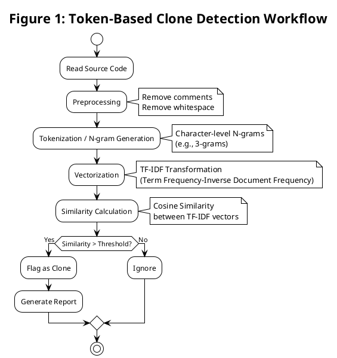
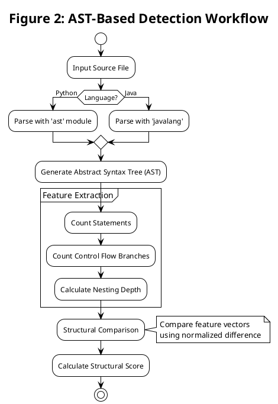
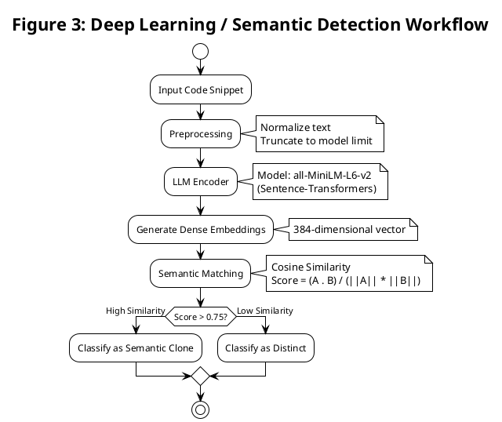
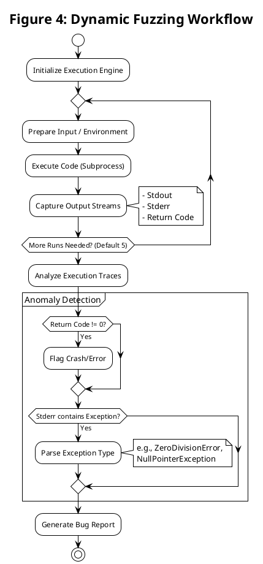
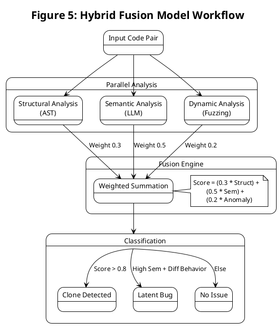
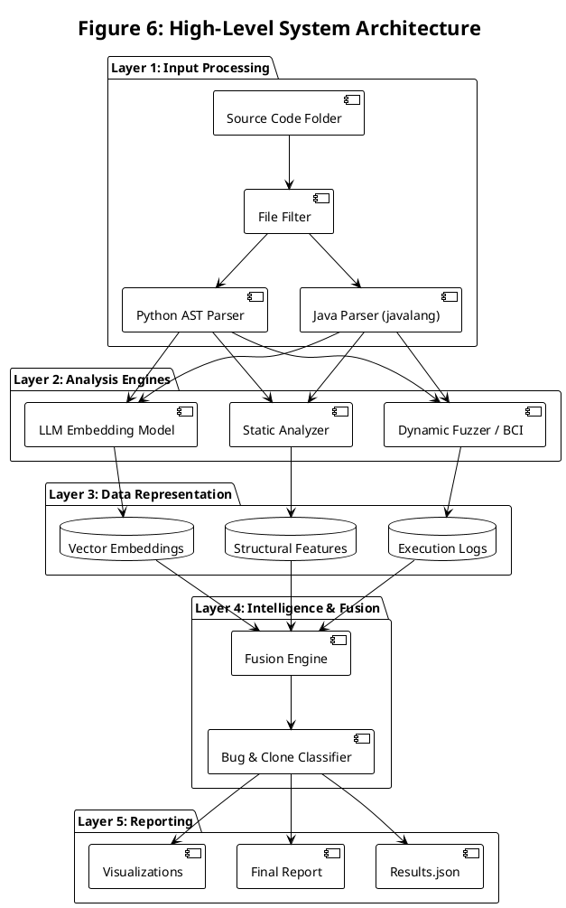

# Report Figures (PlantUML)

This document contains the PlantUML code for the requested figures. You can render these using any PlantUML viewer or editor.

## Figure 1: Token-Based Clone Detection Workflow

## Figure 2: AST-Based Detection Workflow

## Figure 3: Deep Learning / Semantic Detection Workflow

## Figure 4: Dynamic Fuzzing Workflow

## Figure 5: Hybrid Fusion Model Workflow

## Figure 6: High-Level System Architecture

